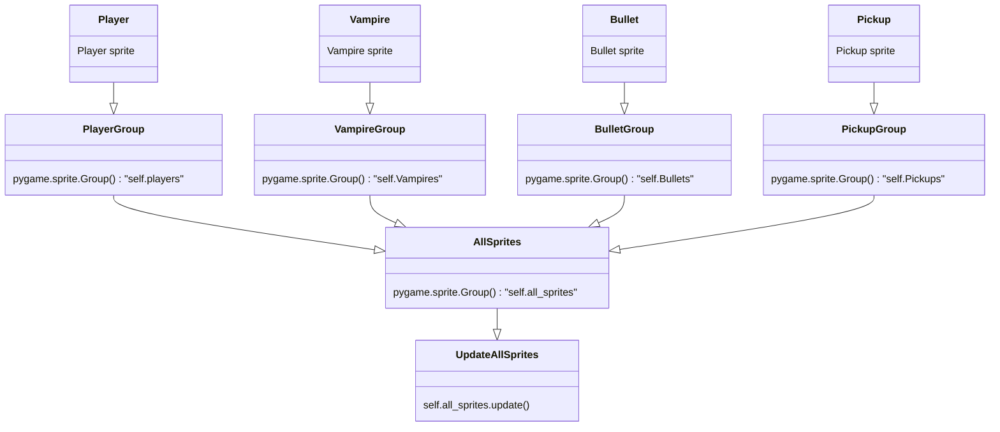
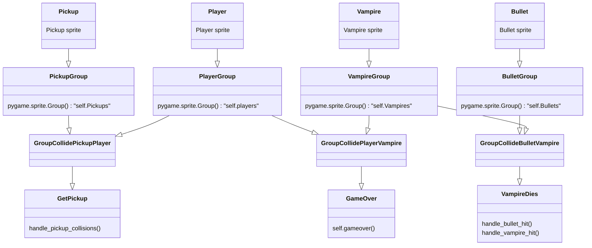
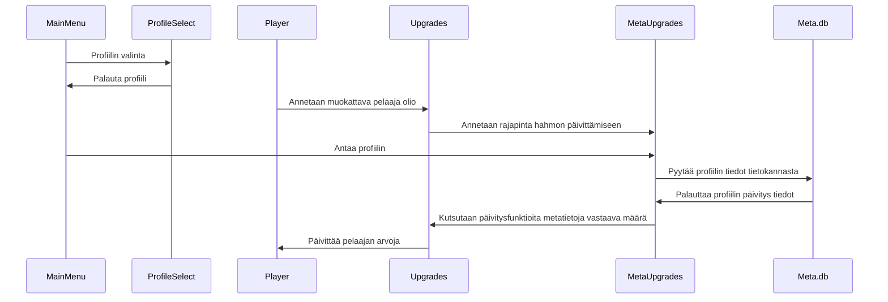
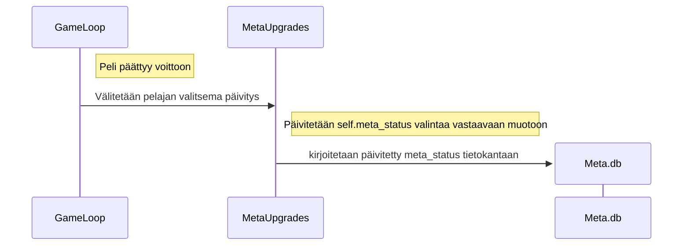

# Arkkitehtuurikuvaus

## Ohjelman rakenne

Ohjelman arkkitehtuuri noudattaa seuraavaa rakennetta:

## Sovelluslogiikkaa

Game luokka sisällyttää kaikki pelissä oleva spritet omiin listoihinsa. Nämä kaikki erittäiset listat sisällytetään sitten all sprites listaan jota päivittämällä saadaan helposti päivitettyä kaikki ruudulla näkyvät spritet. Alla oleva kaavio näyttää tämän toimintaa.

Näistä joukoista tarkistetaan myös niiden väliset osumat (collisions) pygame.sprite.groupcollide() funktion avulla ja sen jälkeen suoritetaan osumasta aktivoituvat tapahtumat.

## Tietokantapyyntöjen logiikkaa

Meta päivitysten haku ja niiden asettaminen pelaajahahmolle uuden pelin alussa toimii seuraavalla kaavalla.

Meta päivitysten lisääminen voitetun pelin päätteeksi ja näiden lisäysten kirjoitus tietokantaan toimii seuraavalla kaavalla. Tämä siis jatkoa ylemmästä kaaviosta, eli voidaan olettaa että MetaUpgrades luokalla on tiedossa pelin alussa saatu profiili ja tietokannasta haettu meta_status.

