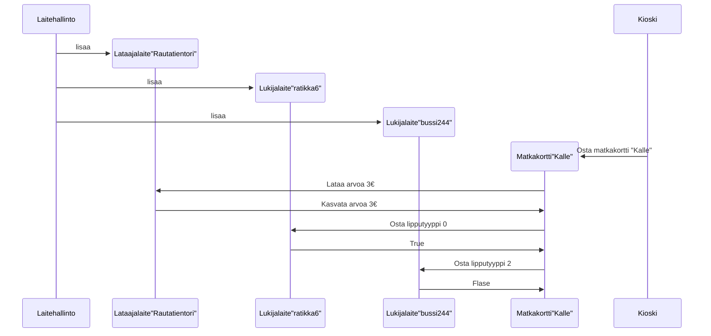

```mermaid
 sequenceDiagram
    create participant Laitehallinto
    create participant Lataajalaite"Rautatientori"
    Laitehallinto ->> Lataajalaite"Rautatientori":lisaa
    create participant Lukijalaite"ratikka6"
    Laitehallinto ->> Lukijalaite"ratikka6":lisaa
    create participant Lukijalaite"bussi244"
    Laitehallinto ->> Lukijalaite"bussi244":lisaa
    create participant Matkakortti"Kalle"
    Kioski ->> Matkakortti"Kalle":Osta matkakortti "Kalle"
    Matkakortti"Kalle" ->> Lataajalaite"Rautatientori":Lataa arvoa 3€
    Lataajalaite"Rautatientori" ->> Matkakortti"Kalle":Kasvata arvoa 3€
    Matkakortti"Kalle" ->> Lukijalaite"ratikka6":Osta lipputyyppi 0
    Lukijalaite"ratikka6" ->> Matkakortti"Kalle":True
    Matkakortti"Kalle" ->> Lukijalaite"bussi244":Osta lipputyyppi 2
    Lukijalaite"bussi244" ->> Matkakortti"Kalle":Flase
```